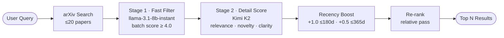

# Paper Scout

Search arXiv and get LLM-ranked, summarized results — fast.

## How it works



## What it does

1. Fetches up to 20 papers from arXiv
2. **Stage 1** — batch-filters with a fast model (`llama-3.1-8b-instant`), dropping obvious misses in one call
3. **Stage 2** — scores each remaining paper on three dimensions: relevance, novelty, and clarity (Kimi K2)
4. Applies a recency boost based on publication date
5. Re-ranks shortlisted candidates relative to each other
6. Returns the top N results with a summary and "why it matters" for each

## Stack

- **arXiv API** — paper retrieval
- **Groq + Llama 3.1 8B** — fast batch filter (Stage 1)
- **Groq + Kimi K2** — detailed scoring and summarization (Stage 2)
- **Gradio** — web UI

## Setup

```bash
pip install -r requirements.txt
```

Create a `.env` file:

```
GROQ_API_KEY=your_key_here
```

## Run

```bash
python app.py
```

Then open the local Gradio URL in your browser.

## Usage

Enter a research query (e.g. `"CRAG techniques for RAG"`), set how many results you want and a minimum score threshold, and click **Search**.

Results include rank, score, title, authors, summary, why it matters, and a link to the paper.

## Config

Edit the top of `paper_scout.py` to change defaults:

| Variable | Default | Description |
|---|---|---|
| `MAX_RESULTS` | 20 | Papers fetched from arXiv |
| `TOP_N` | 5 | Papers shown in final results |
| `FAST_MODEL` | `llama-3.1-8b-instant` | Model for Stage 1 batch filter |
| `DETAIL_MODEL` | `moonshotai/kimi-k2-instruct` | Model for Stage 2 detailed scoring |
| `QUICK_THRESHOLD` | 4.0 | Min score to pass Stage 1 filter |
